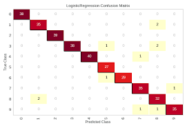

# 리드미 예제
## _프로젝트 테스트_

[

## ✨수행 절차✨

- 프로젝트 수행은 2023년 1월부터 2월부터 알파코 딥러닝 부트캠프에서 진행
- 웹과 딥러닝 두 부분을 진행했으며, 웹 부분은 플라스크를 사용

-딥러닝은 CNN을 사용하였으며, 데이터는 0~9의 숫자 이미지로 이루어진
 MNIST train 6만장 test 3만장으로 사용

- 결과 이미지

- 전체 설계도

## 참고
Krizhevsky, Alex,
 Ilya Sutskever, and Geoffrey E. Hinton. "Imagenet classification 
 with deep convolutional neural networks." Advances in neural 
 information processing systems 25 (2012).

## 느낌점
 CNN으로는 0~9 이미지의 학습 성능이 잘 나왔지만 transform을 어떻게
 주냐에 따라서 성능을 감소시키는 기법들이 뭐인지 리포트하고 싶었다.
